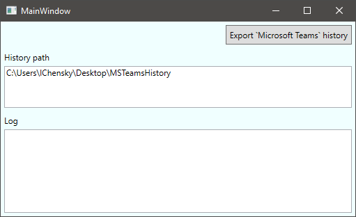

# MSTeams conversations history
Export all conversations from [Microsoft Teams](https://teams.microsoft.com) using active directory and [microsoft graph api](https://docs.microsoft.com/en-us/graph/overview).

## Problems
1. Microsoft Teams does not keep conversations history at your PC. 
1. Microsoft Teams does not provide functionality to export your conversations history. 
2. If any member locked in the active directory(for ex., because he left the company) 
you couldn't even view any messages with this member through Microsoft Teams client(web or descktop). 

## How will this script help?
You can export your conversations history with all members, even if they locked in the active directory.

## How to use this script
1. Download [latest version](https://github.com/ichensky/msteams_history/releases)
2. Run `MSTeamsHistory.exe`
3. Press `Export` button. 
4. Enter your domain login/password.
5. And you'll find your conversations history in the `MSTeamsHistory` directory.  
